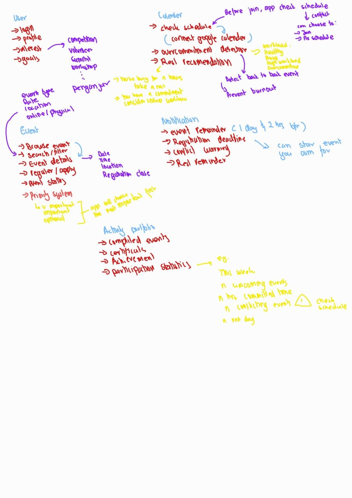
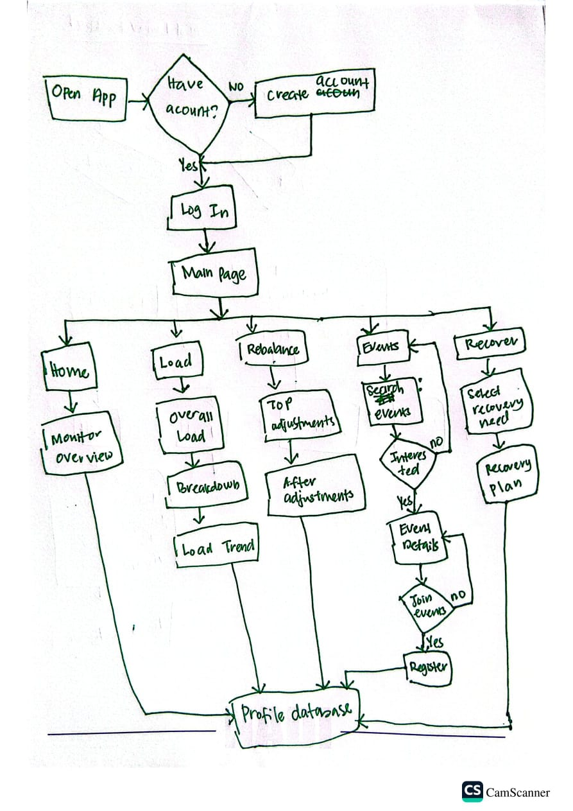
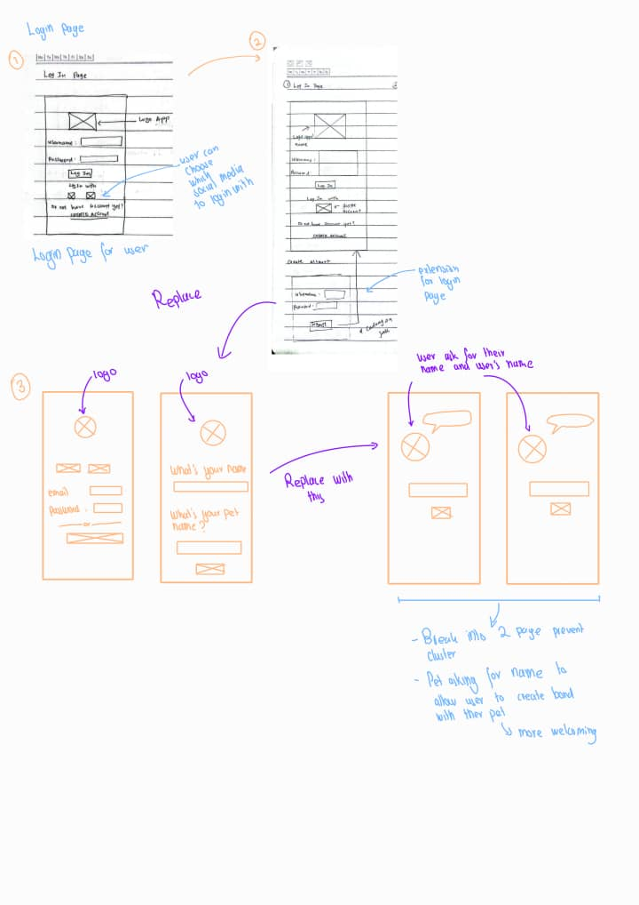
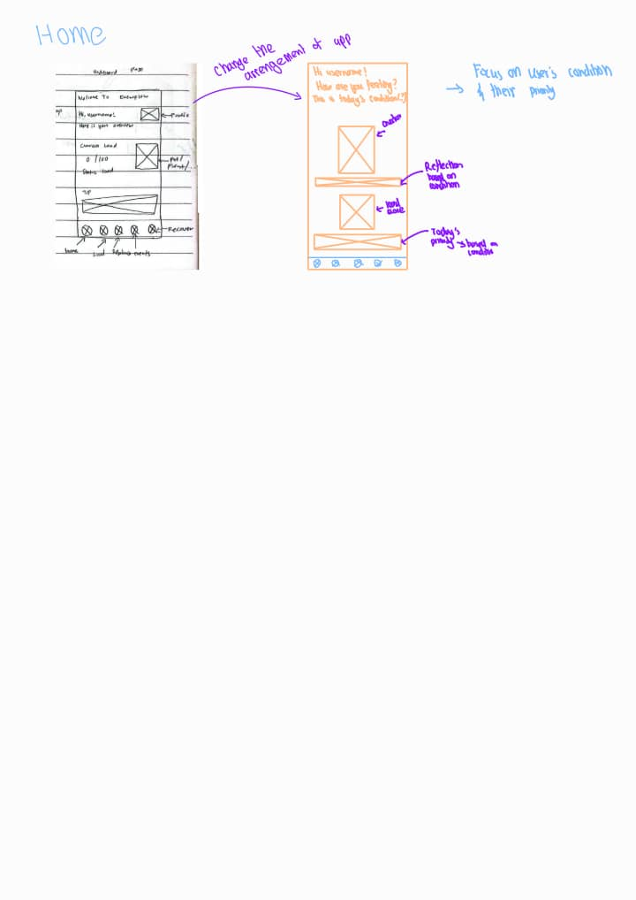
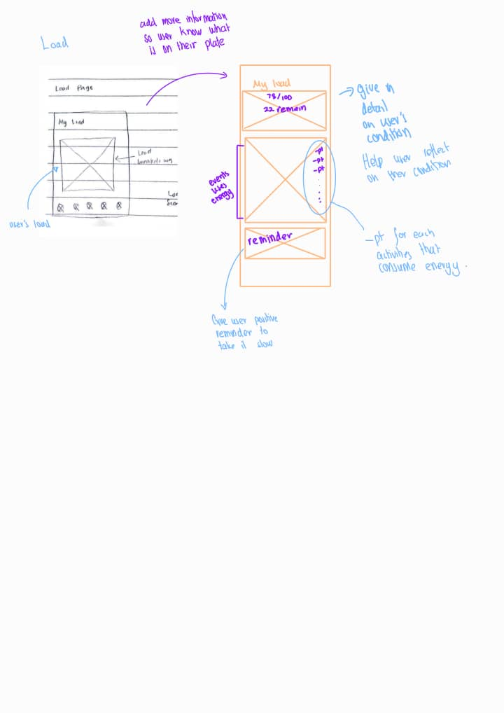
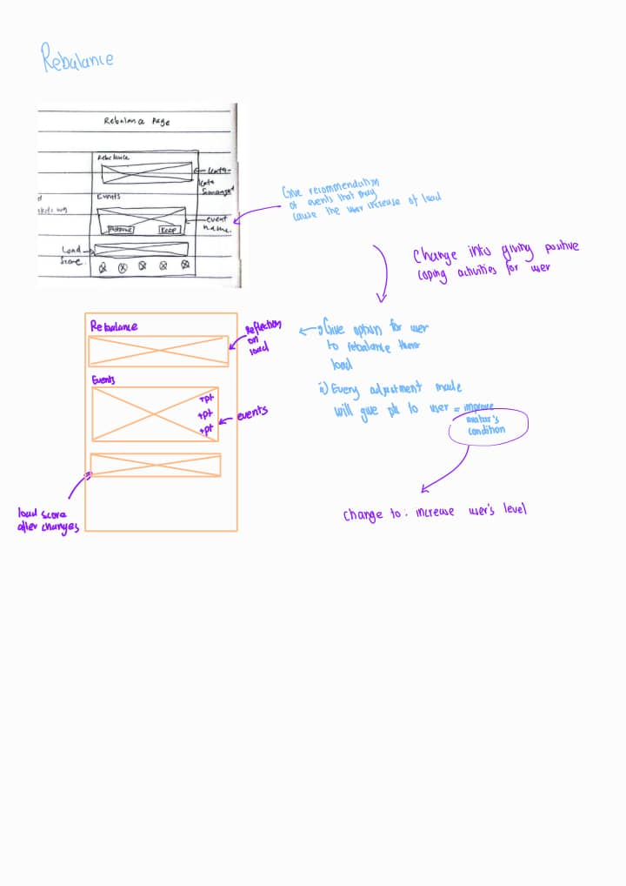
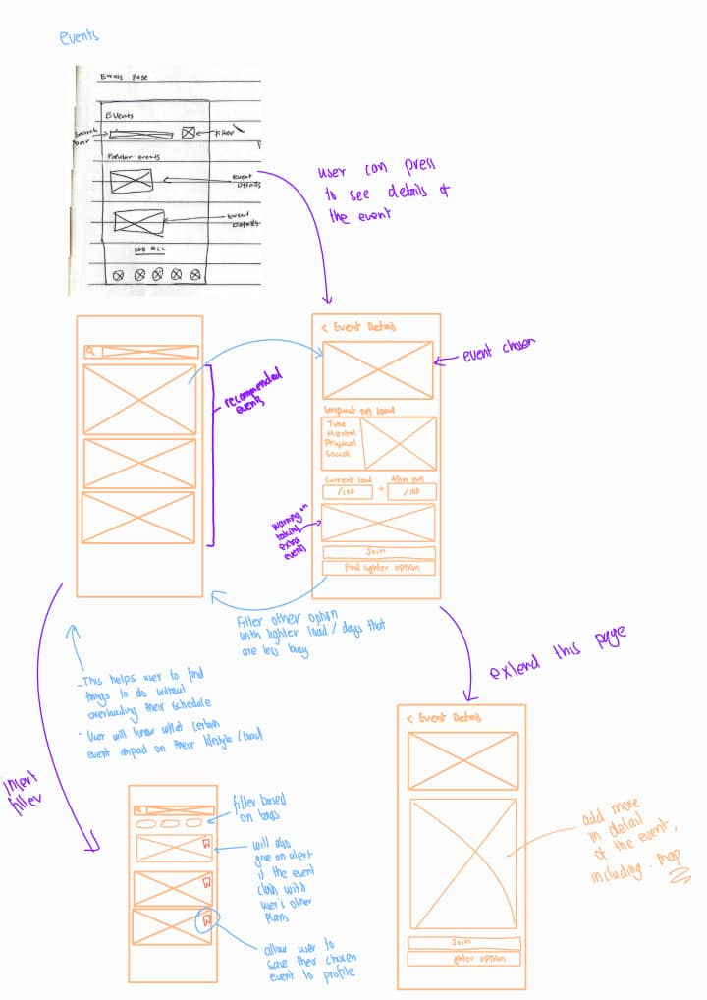
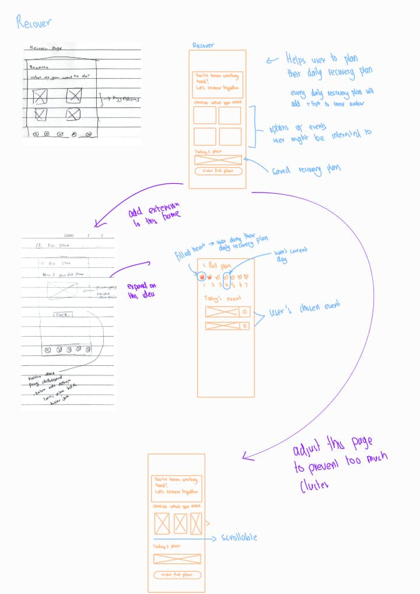
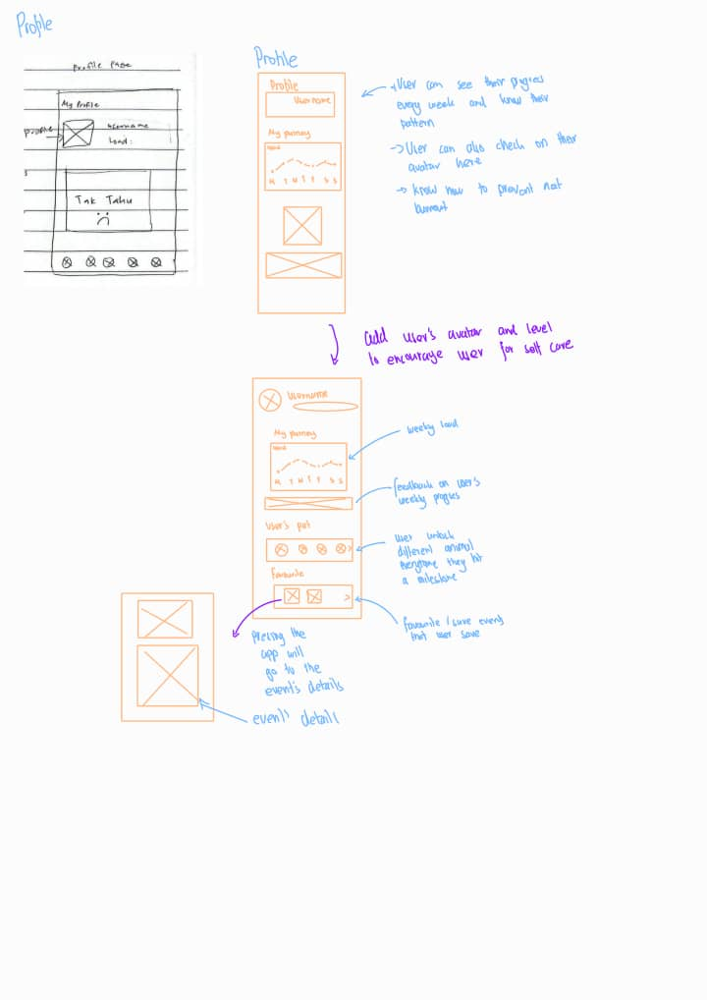

# Kinkou: Balance, pet, and wellness by nullexception

**Team:** Nurnila binti Sabini, Dayang Nur Humaira binti Awg Rastu, Zur Aina Faqihah binti Mohamad Dzaki, Nur Hanni binti Mohamad Sufian

**Problem Statement:** Stress & Workload Manager

**Video Presentation:** (https://www.youtube.com/watch?v=NKe_UdzHGCg)

**Presentation Slides:** (https://canva.link/kinkou-by-nullexception)

**UI Prototype:** (https://www.figma.com/design/vo9gXrFRXJvKeNjdwwm52U/Kinkou-by-nullexecption?node-id=0-1&t=iaTl9xQpsWd1RKtf-1)

# 1. Project Overview

## The Problem

Students carry more than academic deadlines. Their well-being can
be affected by mental, time, physical, social and broader life demands.

Many productivity and workload-management tools are effective at
showing students what they need to do, but tracking commitments alone
does not necessarily help a student decide what to keep, postpone,
rebalance or recover from.

There is also another problem: having fewer commitments does not
automatically mean better well-being. A demanding activity may still
provide enjoyment, meaning, social connection or personal growth.

Students therefore need more than a system that asks:
"How much are you doing?"

They need one that also asks:
"Is what you're doing worth your energy?"

## The Stakeholders

The stakeholders we have identified are students or individuals who are either doing too much which could lead to a *burnout* or not doing anything at all which could lead to a *boreout*.

## Similar Apps

| Similar Apps | App's concept | Shortcoming |
|:----------:|:------------|:----------|
| Quabble, Finch |Share similar concepts, allow users to customize their pets and focus on the user's mental health. Both take different approaches to mental wellness.      Quabble - focus on guiding users toward calmness      Finch - emphasizes on adding coping activities in the user’s schedule | - Addressing only one side of the coin, users need guidance on staying calm and practical tools to schedule positive routines simultaneously. |
| Eventbrite | Provides event information based on user’s current location | - Forces users to manually cross-reference dates to prevent schedule clashes.      - Fails to indicate event intensity, leaving users to gamble on whether they have the mental bandwidth for high-energy activities | 

## Our Solution

Kinkou is a student companion that helps users understand their
mental, time, physical, social and life load, make better decisions
about what to take on, rebalance existing commitments and recover
from stress.

Rather than treating every activity as a cost, Kinkou considers
both the demand an activity creates and the benefit it provides.
This allows the system to distinguish between harmful overload,
meaningful engagement and possible disengagement.

When appropriate, Kinkou can also recommend meaningful activities
and opportunities that fit what the student currently needs.

A virtual companion reinforces healthy decisions through the message:

> "Take care of yourself, and your companion will thrive too."

### Core Features

- Multi-dimensional load tracking
- Overall well-being indicator
- Lightweight energy and engagement check-ins
- Commitment Check: "Is this worth making room for?"
- Demand-versus-benefit activity assessment
- Rebalancing and recovery recommendations
- Context-aware Explore recommendations
- Virtual companion progression

# 2. Ideation & Process

## 2.1 Ideas We Considered

| Idea | Why it was dropped / kept |
|------|---------------------------|
| **Keep** the idea of event searching | Allow users who are more keen to relax themselves by going outside doing activities that they enjoy. This shortened the time users use when searching for events that suits them across different platform. |
| **Keep** Recovery plan | Giving users ways to recover themselves daily and immediately putting the plan into their recovery plan. Users can also customize their recovery plan to give freedom to users on how they want to spend their time. |
| **Keep** user's daily word of affirmation | Giving users different daily words of affirmation based on the user's condition to give encouragement to the user. This can give users a positive effect on their stress levels by promoting a healthier mental outlook. |
| **Keep** Calendar Conflict Detection | The system automatically cross-checks event dates and times against the user's personal calendar, allowing users to instantly identify scheduling conflicts before joining an event. |
| **Keep** Pet (User's Companion) | The pet helps users to reflect on their current condition which is happy, normal, sad, and depressed. This helps because sometimes the users might be overloading themselves with activities without the realizing the tolls on their current physical and mental state. |
| **Keep** User level | Encourage users to keep themselves happy by rewarding them with different type of animal every time they hit a new level. |
| **Discard** the idea of giving separate progression bar for Load, Daily Stress, Care XP, and Pet Happiness | Too much different progressions can cause the userss to get frustrated on how the app works causing the user to be more upset using the app rather than more relaxed. |
| **Discard** the idea to add streak to the app | Prevent users from overly stressing with the burden of keeping the streak alive. The loss of the streak might cause the user to be overly frustrated and causing users to give up on keeping the streak alive. |

## 2.2 Ideation Boards

## 2.3 Mentor Consultation

| Date | Mentor | Feedback Received | What Was Changed |
|------|--------|-------------------|------------------|
| 7 September | Faris Imran | Mr. Faris said he loves the design and the use of pixel art for the app. The pet and event searching could be unique selling points. In order to prevent the event searching from overpowering the app and going off track from the problem statement, we should know how to frame the app appropriately. | We changed the initial name from EventFlow to Kinkou: a Japanese word carrying the meaning of "balance", highlighting that our app is for users to find the balance in their life. |

# 3. Design & Prototype

UI Prototype: [link]

# 4. What Makes It Different

| Novel Feature | What Makes It Different |
|---------------|-------------------------|
| Demand + Benefit Assessment | Kinkou does not assume every demanding activity is harmful. It considers both what an activity takes (time, mental, physical, social, and life load) and what it gives back (enjoyment, meaning, connection, and growth). |
| "Make Room" Recommendation | Instead of simply telling an overwhelmed student to avoid a meaningful activity, Kinkou helps them identify lower-value commitments that could be postponed, reduced, or replaced to make room for what matters. |
| Context-Aware Opportunity Discovery | Unlike a conventional event platform, opportunities are recommended based not only on interests or location, but also on the student's current load and needs. An overwhelmed student may receive low-demand activities, while an under-engaged student may receive meaningful opportunities for growth or connection. |
| Burnout + Under-engagement Support | A low workload is not automatically treated as good. Kinkou combines workload with energy and engagement signals to recognise when a student may be overloaded or lacking meaningful engagement. |
| Self-Care Companion, Not Productivity Pet | The virtual companion thrives through sustainable decisions—resting, rebalancing commitments, and maintaining meaningful engagement—rather than simply rewarding users for completing more tasks. |

# 5. Technical Architecture & Feasibility

## Tech stack

| Component | Technology | Why We Chose It | Expected Constraints |
|-----------|------------|-----------------|----------------------|
| Frontend | React Native + Expo | Allows us to build a cross-platform mobile application using a single codebase. Expo simplifies development, testing, and deployment, which is suitable for a short hackathon development period. | Some advanced native features may require additional configuration or platform-specific testing. |
| Programming Language | TypeScript | Provides stronger type checking than JavaScript and allows the frontend and backend logic to use the same language, making the codebase easier to maintain. | Requires slightly more setup and type management compared with plain JavaScript |
| Backend | Firebase Cloud Functions | Handles server-side logic such as workload calculations, event processing, recommendation generation, and secure communication with external APIs without requiring us to manage our own server. | Usage is subject to quotas, and some deployment features may require billing configuration. |
| Database | Cloud Firestore | Stores user profiles, commitments, daily check-ins, workload scores, event information, recommendations, and virtual companion progress. It integrates directly with the rest of Firebase. | Read/write operations are quota-based, so database queries must be designed efficiently. |
| Authentication | Firebase Authentication | Provides secure login and user account management without requiring us to build an authentication system from scratch. | Certain logic providers may require additional configuration and may have usage limits. |
| Event Data | EventBrite API + manually curated local events | Eventbrite can provide public event information, while local events that are not available through externa platforms can be manually added to the database by the Kinkou team. | Eventbrite coverage may not include smaller or local events. External APIs are also subject to availability, access policies, and rate limits. |
| Maps & Location | Google Maps Platform | Helps users understand where activities are located and can support location-based event discovery and distance relevance. | Requires API configuration, user permission for location features, and usage is subject to quotas and billing limits. |
| Recommendation Logic | Rule-based Demand Benefit algorithm | Allows Kinkou to evaluate whether an activity is suitable based on the user's current workload, energy, engagement, and the activity's expected demand and benefit. This keeps the core system predictable and independent of generative AI. | Rules must be carefully designed and tested to avoid overly simplistic recommendations. Personalisation will initially be limited compared with more advanced adaptive systems. |
| Cloud / Hosting | Firebase + Google Cloud | Provides the infrastructure for authentication, database storage, backend functions, and related cloud services in one integrated ecosystem. | Free-tier quotas apply, and certain services may require a billing account. |
| Version Control | Git + GitHub | Supports team collaboration, version history, branching, and code review. | Poor branch management may cause merge conflicts during development. |
| UI/UX | Figma | Allows the team to design and test the user interface collaboratively before implementation. | The final implementation may differ slightly from the prototype due to technical or time constraints. |
| Development Environment | VS Code | Lightweight development environment with strong support for React Native, Expo, Firebase, and TypeScript. | Requires local development setup and dependency management. |

## Build plan & scope

During the building phase, we will focus on a functional MVP of Kinkou containing its core workload-management experience.

| Priority | MVP Scope |
|----------|-----------|
| Core | Commitment tracking, five load dimensions, daily energy/engagement check-ins |
| Decision Support | Demand-Benefit assessment, Commitment Check, and rule-based rebalancing recommendations |
| Explore | Small set of API-sourced and manually curated local activities, with basic location support |
| Engagement | Simple virtual companion progression based on healthy decisions and self-care |

